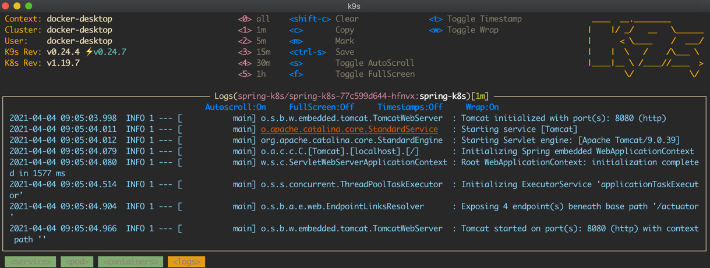
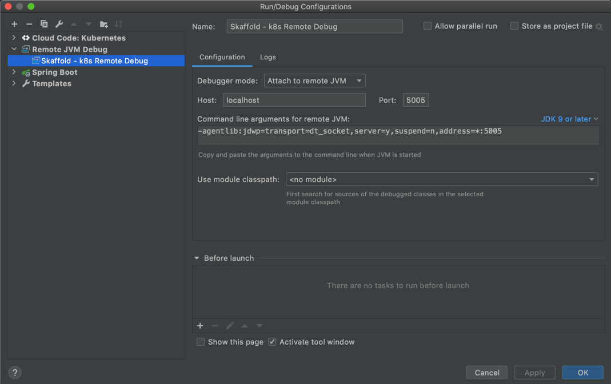
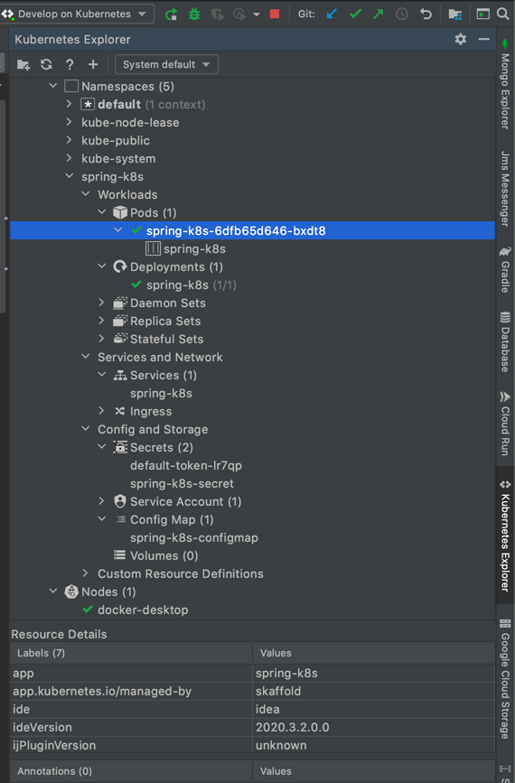

# Local Kubernetes Development with Java/Spring Boot application (Workshop)

This repository contains sample Spring Boot application, k8s definitions and scaffold setup.

## What You will learn

* How to set up **Readiness** and **liveness** probes.
* How to wait for container lifecycle processes to finish.
* How to enable **graceful shutdown**.
* How to expose metrics.
* How to configure **logstash-logback-encoder**.
* How to **debug** application running inside k8s.
* How to use **live-reload** feature for faster development.
* How to use common kubectl commands and generate k8s definitions.  
* How to use **Skaffold** for local Kubernetes development.
* How to use **Cloud Code** plugin in IntelliJ.

## Getting Started

### Prerequisite

* Java 11
* Docker
* Kubernetes

### Installation

Build docker image.
```shell
./gradlew bootBuildImage
```

### Usage

#### Kubectl

* Apply k8s configurations files from a directory.
  ```shell
  kubectl create -f k8s/namespace.yml
  kubectl apply -f k8s/
  ```
* Port forward *spring-k8s-workshop* service.
  ```shell
  kubectl port-forward svc/spring-k8s-workshop 8080:8080
  ```
* Visit http://localhost:8080/hello resource.

* Play with kubectl api, see section 'Additional Useful Commands'.

* [Optionally] Install and play with **k9s** tool (https://github.com/derailed/k9s).
  

* Destroy all *spring-k8s-workshop* components.
  ```shell
  kubectl delete all --all -n spring-k8s-workshop
  kubectl delete ns spring-k8s-workshop
  ```

#### Skaffold

* Run a pipeline in development mode.
    ```shell
    skaffold dev --port-forward
    ```
    *** **--port-froward** - expose ports. 
  
    *** **--trigger=manual** - disable auto-build (triggered after file change). Allowed values polling, notify, manual.
  
* Visit http://localhost:8080/hello resource.
  
* Make some changes inside HelloController class to see *live reload* feature.
  
* Stop skaffold dev (`CMD + C`).
  
* Run skaffold in debug mode.
    ```shell
    # Similar to `dev`, but configures the pipeline for debugging. Auto-build and sync is disabled by default to prevent
    # accidentally tearing down debug sessions.
    skaffold debug --port-forward
    ```
* Configure remote debugging in Intellij Idea.
  
  
* Start Debug session in Intellij Idea and create breakpoint inside HelloController.class 

#### Cloud Code

* Watch this amazing Google Cloud Tech introduction how to use plugin - [Cloud-native development in the IDE with Cloud Code](https://www.youtube.com/watch?v=g9gIgiNsRgg).
  
* Install **Cloud Code** plugin from https://plugins.jetbrains.com/plugin/8079-cloud-code.
  
* Play again with sample application this time using **Cloud Code** plugin;)
  
  

## Additional Useful Commands

**Create k8s definitions using --dry-run.**
```shell
# Create secret definition
kubectl create secret generic spring-k8s-workshop-secret --dry-run=client -o=yaml > secret.yaml

# Creating deployment definition
kubectl create deployment deployment_name --image=spring-k8s-workshop:0.0.1-SNAPSHOT --dry-run=client -o=yaml > deployment.yaml

# Create Service definition
kubectl create service clusterip spring-k8s-workshop --tcp=8080:8080 --dry-run=client  -o=yaml >> service.yaml

# Create config map from yml file
kubectl create configmap --dry-run somename --from-file=./src/main/resources/application-dev.yml -o=yaml
```

**Create Secret.**
```shell
# Create secret and base64 encode it
echo -n "Secret from k8s" | base64

# Create secret, base64 encode it and add it to your clipboard
echo -n "Secret from k8s" | base64 | pbcopy
```

## References

* [Spring on Kubernetes](https://spring.io/guides/topicals/spring-on-kubernetes/)
* [Skaffold - Local Kubernetes Development Made Easy](https://www.youtube.com/watch?v=tTNrzEjROCo)
* [Skaffold - Github releases](https://github.com/GoogleContainerTools/skaffold/releases)
* [Google Cloud - Cloud Code](https://cloud.google.com/code)
* [Cloud-native development in the IDE with Cloud Code](https://www.youtube.com/watch?v=g9gIgiNsRgg)
* [Best Practices to Spring to Kubernetes Easier and Faster by Ray Tsang](https://www.youtube.com/watch?v=c16oOeTfFXM)
* [k9s](https://github.com/derailed/k9s)

## License

Distributed under the MIT License. See `LICENSE` for more information.